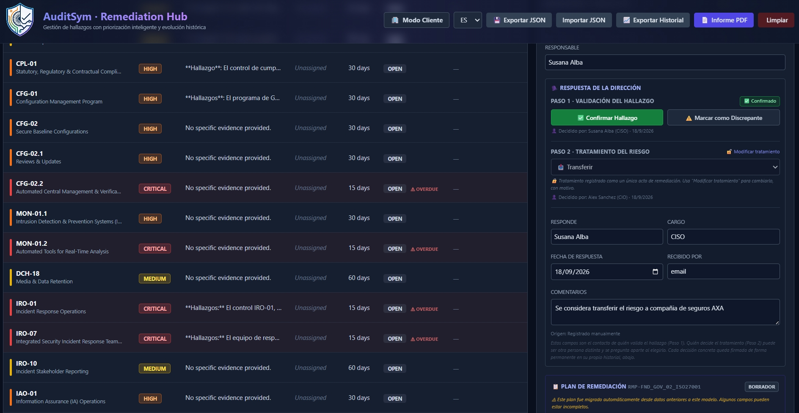

# 🛡️ AuditSym — AI-Assisted Cybersecurity Audit & GRC Platform

<div align="center">

**Local-First cybersecurity audit platform combining multi-framework assessment, traceable evidence, professional reporting, and corrective-action management in one audit lifecycle.**

[](https://github.com/SUALBA/AuditSym/releases)
[](LICENSE)
[](#-key-features)
[](#-platform--privacy)
[](#-platform--privacy)

[🌐 Website](https://auditsym.com) ·
[📄 Sample Audit Report](docs/sample-reports/auditsym-nist-csf-2.0-sample-report.pdf) ·
[📖 Documentation](docs/m3-data-model-reference.en.md) ·
[🐛 Issues](https://github.com/SUALBA/AuditSym/issues)

</div>

---

## 👥 Core Contributors

AuditSym is developed through a combination of product vision,
audit methodology, hands-on engineering, and technical collaboration.

#### 👩‍💻 Project Founder · Product & Audit Vision

**Susana Alba Santamaria**
Product Strategy · Audit Methodology · UX · Cybersecurity & GRC · Core Development
📧 sualba.dev@gmail.com

#### 👨‍💻 Core Technical Contributor · Architecture & Technical Review

**Vandan Panwala**
Software Engineering · Cybersecurity · Architecture · Technical Review
🔗 [GitHub Profile](https://github.com/PanwalaVandan)

---

## 🎯 What problem does AuditSym solve?

Many audit workflows still fragment assessment, evidence, findings, and remediation across separate tools and spreadsheets. A CISO or auditor opening AuditSym should understand immediately that this isn't a checklist: it connects **assessment → evidence → findings → management response → remediation → verification** as one continuous audit lifecycle, not five disconnected spreadsheets.

| The Problem | The AuditSym Approach |
|-------------|-----------------------|
| Cloud-hosted GRC workflows may require sensitive audit data to leave the local environment | **Local-First by design.** Audit data and evidence remain local by default. Ollama enables fully local AI; cloud AI providers (OpenAI, Anthropic, Groq, OpenRouter) are optional and explicitly configured by the user. |
| Single-framework silos | **Multi-Framework** — NIST CSF 2.0, ISO 27001, CIS Controls v8, and COBIT 2019 assessed against one unified control catalogue. |
| Manual, spreadsheet-based audits with no real workflow after the PDF is sent | **A real audit lifecycle** — findings carry a formal management response (confirm/dispute, treatment), a corrective-action plan with owners, actions, and evidence, all the way to a state ready for independent verification. |
| AI tools that quietly make the call for you | **Human-in-the-loop AI** — AI drafts and suggests; every validation, treatment decision, and version issuance is an explicit, attributed human action. |
| No prioritization of findings | **Priority Matrix** — Quick Wins first (Impact vs. Effort). |
| Audit evidence that isn't distinguishable from remediation evidence, or traceable at all | **Two separate, ID-stable evidence registers** — source audit evidence (`EVD-####`) and remediation implementation evidence (`REM-EVD-####`), neither ever reusing a withdrawn ID. |

---

## ⚠️ Current status & limitations

**Current status:** active development / MVP validation. Being iteratively reviewed with professional audit feedback during MVP validation, not yet a finished production SaaS.

**Current limitations, stated plainly:**
- Primary data persistence is local (browser `localStorage`) — there is no server-side database yet. Export/import JSON is the mechanism for backup and transfer between machines.
- Single-user per browser session — there is no multi-user collaboration or authenticated access control yet. Role toggles (auditor/client) in the Remediation Hub are workflow gating for an honest user, not a security boundary.
- Framework catalogue governance — systematic validation, versioning, and authoritative-source mapping rationale for NIST CSF 2.0 and the other supported frameworks is being formalized under [#35](https://github.com/SUALBA/AuditSym/issues/35). Treat current mappings as a working reference, not a certified crosswalk.
- Tailwind CSS, Chart.js, and jsPDF/FileSaver.js currently load from public CDNs. Until those are bundled locally, a fully air-gapped machine with nothing cached does not have guaranteed full functionality — "Local-first" today, not yet "offline/air-gapped ready."

We'd rather an auditor read this section and trust the rest of the document than discover a gap on their own.

---

## 🔄 The Audit Lifecycle

AuditSym implements a real audit lifecycle, not a one-shot assessment:

```
Plan → Scope → Fieldwork → Findings → Management Response → Remediation → Follow-up / Verification → Closure
 🟡      🟡        ✅          ✅              ✅                 ✅              🔜                    🔜
```

**Implemented today:** structured control assessment (fieldwork), findings generation with severity and evidence, a formal management-response workflow (confirm/dispute, treatment decision), and a full corrective-action remediation plan that carries a finding through execution. Engagement metadata — scope description, methodology, criteria, and dates — is captured and carried into the report, but planning and scoping don't yet have a dedicated workflow of their own the way Fieldwork, Findings, and Remediation do; that's still evolving.

**The important line to understand about where the product is today:** a remediation plan only ever reaches `ready_for_verification`. **Remediation does not close findings.** Independent verification and formal closure belong to the next milestone (Follow-up), tracked as a distinct phase — not something the Remediation Hub silently claims for itself.

---

## 📸 Interface Preview

### Work View — where hours are actually spent


Selecting a control switches to a compact list on the left and one large, focused panel on the right — question, auditor notes, and evidence all visible at once, with Previous/Next navigation. Built for the reality of spending hours entering data, not just reviewing a summary.

---

### Finding & Management Response



*Every finding carries severity, reasoning, and a recommendation, plus a formal management response: confirmed or disputed (with reason and evidence), and — once confirmed — a treatment decision (avoid / mitigate / transfer / risk accepted), each with the responding person, role, date, and channel recorded. This is what makes the audit trail defensible, not just a status field.*

---

### Evidence Register


*Structured, audit-wide evidence with stable `EVD-####` identifiers, type, source, collection method, and review state — never renumbered, never silently reused after withdrawal.*

---

### Professional Audit Report (PDF) — Executive Summary


The generated PDF opens with a CEO-ready executive summary: compliance and criticality charts, a plain-language posture statement, and the top critical findings named explicitly — no raw control tables on the first page.

---

### Professional Audit Report — Findings & Evidence Annex


Every non-conformant, partial, **and** compliant control gets its own findings/evidence/recommendation write-up in the annex — the report is traceable, not just polished.

---

### Remediation Plan Detail


*Owner, target date, weighted progress from active actions, milestones, dependencies, implementation evidence — building toward `ready_for_verification`, never silently marked closed.*

<details>
<summary>Additional screenshots (dashboard, version control, historical evolution)</summary>


</details>

---

## ✨ Key Features

### Audit Engine (`ui/auditnist-local.html`)
- **Multi-Framework Support** — NIST CSF 2.0, ISO 27001, CIS Controls v8, and COBIT 2019, evaluated against a unified internal control catalogue.
- **Compliance states** — Compliant / Partial / Non-Compliant / Not Applicable, with a mandatory written justification whenever a control is marked Not Applicable.
- **Risk-weighted scoring** with a maturity model, distinct from the simple compliance percentage — the report explains both explicitly rather than letting them be confused.
- **Structured Evidence Register** — stable `EVD-####` identifiers, type/source/collection-method metadata, review state, and auditable withdrawal history that never reuses an ID.
- **Findings** carry severity, reasoning tied to the evidence gathered, and a recommendation.
- **AI-assisted, human-validated** — risk narrative drafting and evidence analysis via local RAG (semantic search over PDF policies/procedures), always requiring explicit human confirmation before anything is recorded.
- **5 AI providers**: Ollama (local), OpenAI, Anthropic, Groq, OpenRouter — with a deterministic scoring fallback when no AI provider is available.
- **Document control & issuance workflow** — reviewer/approver roles, self-approval and independent-review governance disclosure, version history, and a locked, immutable snapshot on issuance.

### Findings & Management Response
This is where AuditSym starts to differ from a simple assessment tool. Each finding is a structured record — severity, reasoning, and recommendation, viewable from both an auditor and a client perspective — that the audited organization formally responds to: **confirmed** or **disputed** (with a reason and supporting evidence, subject to auditor adjudication). Once confirmed, management records a **treatment**: avoid, mitigate, transfer, or risk-accepted — each decision attributed to a named person, role, date, and channel, and preserved in an append-only history. The result is an audit trail a reviewer can actually defend, not a status dropdown.

### 🗂️ Evidence Register — audit evidence vs. remediation evidence
Every piece of source audit evidence gets a stable, audit-wide `EVD-####` identifier — with provenance, review state, and a withdrawal history that never reuses an ID once issued. It's carried through document-version snapshots and the audit → remediation handoff unchanged, and rendered in its own Evidence Annex in the PDF report.

Critically, this is a **separate register** from remediation implementation evidence:
- `EVD-####` — the auditor's source evidence for the original finding. Immutable once carried into the Remediation Hub; the Hub displays it read-only, never edits it.
- `REM-EVD-####` — evidence that a corrective action was actually carried out, created and managed inside the Remediation Hub.

### 🛠️ Remediation Hub (`ui/remediation-hub.html`)
A corrective-action plan is built around: an owner and accountable owner, a target date (changeable only through a structured, approved change request — never a silent edit), weighted actions (`ACT-####`), milestones (`MLS-####`), dependencies (`DEP-####`), implementation evidence (`REM-EVD-####`), and an expected residual risk explicitly labeled as management's estimate, not auditor-verified. Progress is always derived from weighted active actions, never manually typed. The plan moves through `draft → planned → in_progress → blocked → ready_for_verification`, with every material change recorded in an append-only revision history, and role gating that keeps plan authorship with the audited organization.

**Remediation does not close findings.** M3 ends at `ready_for_verification` — independent verification and formal closure belong to the next milestone, Follow-up.

### 🔗 The Audit → Remediation Handoff
When an audit version is formally issued, AuditSym generates two sibling artifacts from the same immutable, locked snapshot: the official PDF report, and a version-matched remediation JSON carrying every finding, its evidence, and its management-response state. The Remediation Hub isn't a second, disconnected application — it's the continuation of the same case file, picking up exactly where the issued version left off.

### 📄 Professional Audit Report (PDF)
Structured in three layers — **Executive Summary → Findings → Technical/Evidence Annex** — with a document-control cover page, confidentiality classification, scope and methodology, sampling and limitations, and a clear distinction between the simple compliance percentage and the risk-weighted security-posture score. Findings are grouped by consolidated framework outcome with full traceability back to the underlying internal controls, including a documented, deterministic rule for how multiple internal controls consolidate into one framework-level result. Every control — compliant, partial, non-compliant, and N/A — gets its own evidence narrative in the annex, alongside the Evidence Register, reviewer/approver sign-off, version footer, and a formal end-of-report marker.

### 🤖 Human-in-the-loop AI
AI is a co-pilot, never the auditor of record. It **can**: draft executive narrative, assist with risk-level suggestions, analyze evidence/documents via local RAG, and suggest remediation guidance. It **cannot**: validate a finding, accept a risk, approve or issue a document version, or substitute professional judgment — every one of those remains an explicit, named human action.

**Local AI vs. cloud AI, stated precisely:** Ollama runs entirely on your machine. OpenAI, Anthropic, Groq, and OpenRouter are optional, cloud-based, and only used if you explicitly configure one — audit data is not sent anywhere unless you've made that choice yourself.

### 🌍 Platform & Privacy
- **7 Languages**: ES, EN, FR, DE, PT, AR, ZH — including right-to-left layout for Arabic, and a single language choice that propagates across the landing page, Audit Engine, and Remediation Hub.
- **Local-First Design** — no backend required; all audit and evidence data persists in the browser.
- **Export/Import** — bidirectional JSON sync between the Audit Engine and Remediation Hub, plus PDF report generation.

---

## 🔐 Auditability & Traceability

Key audit and remediation decisions in AuditSym leave a traceable record:

- Stable, never-reused identifiers for findings, evidence (`EVD-####` / `REM-EVD-####`), actions (`ACT-####`), milestones (`MLS-####`), dependencies (`DEP-####`), and change requests (`CRQ-####`).
- Full finding history: validation decisions, treatment changes, disputes and adjudications.
- Append-only remediation-plan revision history for every material change, with actor, role, timestamp, and reason.
- Version snapshots that exactly match the artifact actually issued — the PDF and the remediation handoff are both generated from the same locked snapshot, not regenerated live from mutable data.
- Evidence withdrawal that preserves the record (a tombstone), never a silent delete or ID reuse.

---

## 🧭 Separation of Responsibilities

- **The auditor** identifies findings, gathers and structures evidence, and — later, under Follow-up — verifies remediation.
- **Management** (the audited organization) responds to findings, decides treatment, and executes the corrective-action plan.
- **Reviewer / Approver** review and formally issue the audit report version.
- **Follow-up** (next milestone) independently verifies remediation and performs formal closure.

This separation is already reflected in the product today — auditor and client views differ, and document issuance follows an explicit reviewer/approver workflow with recorded governance decisions, rather than being treated as a simple save action.

---

## 🏗️ Architecture

```
Landing (ui/landingPAge.html)
        │
        ▼
Audit Engine (ui/auditnist-local.html)
        │
        ▼
Issued, immutable version snapshot
        │
        ├──▶ Official PDF report
        └──▶ Version-matched Remediation JSON
                        │
                        ▼
            Remediation Hub (ui/remediation-hub.html)
                        │
                        ▼
            Follow-up / Verification (next milestone)
```

The current implementation keeps all data local to the browser; the roadmap's Product Hardening phase covers moving toward more robust, modular local persistence rather than a purely client-side model.

**Tech Stack:**
- **Frontend**: HTML5, CSS3 (Tailwind CSS / custom), JavaScript (ES6+) — three self-contained pages, no build step.
- **Visualization**: Chart.js
- **Reporting**: jsPDF, FileSaver.js
- **Storage**: Browser `localStorage` (local-first)
- **AI Integration**: local Ollama, or REST calls to an explicitly configured cloud provider
- **RAG**: optional local Python server (`rag/server.py`) for PDF semantic analysis

---

## 🛣️ Roadmap

### ✅ Foundation & Audit Engine — Completed
Multi-framework assessment (NIST, ISO, CIS, COBIT) · AI-assisted evaluation with 5 providers · local RAG · deterministic scoring fallback · document control, reviewer/approver, and versioned issuance.

### ✅ Findings → Management Response → Remediation — Completed
Structured findings · Evidence Register (`EVD-####`) with provenance and withdrawal history · Not-Applicable justification enforcement · professional PDF reporting · confirm/dispute/treatment management response · audit → remediation handoff · M3 corrective-action planning (owners, actions, milestones, dependencies, `REM-EVD-####` implementation evidence, change requests) · plans reaching `ready_for_verification`.

### 🔵 Follow-up & Verification — Next
- [ ] Independent re-test of remediated controls
- [ ] Verification evidence, distinct from remediation evidence
- [ ] Auditor-verified residual risk (replacing management's estimate)
- [ ] Failed verification / reopening a plan
- [ ] Formal finding closure

### 🟣 Product Hardening & Scale — Future
- [ ] [#35](https://github.com/SUALBA/AuditSym/issues/35) — Framework catalogue governance: validation, versioning, authoritative mapping
- [ ] Local persistent storage beyond browser `localStorage`
- [ ] Identities and roles (real access control, not workflow gating)
- [ ] Backup and migration tooling
- [ ] Selected integrations (e.g. Jira, ServiceNow)
- [ ] Multi-user collaboration

---

## 🧪 Regression Testing

> **This section is for whoever is touching the code, not for regular users.** If you just want to use AuditSym, "Running the Project" below is all you need.

Three Playwright-based suites cover real bugs found and fixed during development, so a future change can't silently reintroduce them:

| Suite | Covers |
|---|---|
| `tests/e2e/regression_suite.mjs` | Audit Engine — evaluation, evidence register, scoring, document control, issuance, PDF |
| `tests/e2e/regression_suite_hub.mjs` | Remediation Hub — finding lifecycle, M3 plan state machine, role gating, portfolio, handoff import |
| `tests/e2e/regression_suite_language_flow.mjs` | Cross-page i18n sync across all three pages, all 7 languages, RTL, and that Remediation copy never claims to close a finding |

**Prerequisites:** [Node.js](https://nodejs.org) 18+.

**Setup (one time):**
```bash
npm install --save-dev playwright
npx playwright install chromium
```

**Run them:**
```bash
node tests/e2e/regression_suite.mjs
node tests/e2e/regression_suite_hub.mjs
node tests/e2e/regression_suite_language_flow.mjs
```

Each suite runs headless, spins up its own local server, and prints a PASS/FAIL line per check. Results depend on the exact state of the code at the time you run them — don't rely on a number quoted here; run the suite and read its own output.

**If you see a ❌:** don't push yet. Re-run once to rule out a flaky run, then check whether your change genuinely affects that behavior. If it's a real regression, fix it before pushing; if the test itself seems wrong for a legitimate new behavior, update the test rather than deleting or skipping it, and say so in your commit message.

---

## 🚀 Running the Project

The three pages live under `ui/`:

**Option 1: Direct Open**
Open `ui/landingPAge.html` in your browser — it links to both the Audit Engine and the Remediation Hub. Or open `ui/auditnist-local.html` / `ui/remediation-hub.html` directly.

**Option 2: Local Server (Recommended)**
```bash
python -m http.server 8080
```
Then visit `http://localhost:8080/ui/landingPAge.html`.

**Option 3: Local RAG Server (Optional)**
For PDF semantic search and document analysis:
```bash
python rag/server.py
```
Then use the "Auto Analyze" feature in the Audit Engine.

---

## 📄 Sample Audit Report

[📄 View the AuditSym NIST CSF 2.0 sample report](docs/sample-reports/auditsym-nist-csf-2.0-sample-report.pdf)

Probably the fastest way for an auditor to go from "is this just another demo?" to "this is a real report structure" — entirely synthetic data, not a real organization, certification, or assurance opinion.

---

## 🤝 How to Contribute

AuditSym welcomes contributors. The priority right now is the product's audit methodology and lifecycle, not UI polish — see [Issues](https://github.com/SUALBA/AuditSym/issues) for what's open, especially anything tagged around Follow-up/Verification or framework governance ([#35](https://github.com/SUALBA/AuditSym/issues/35)).

If you're looking for a smaller first contribution, UI/UX and accessibility improvements are always welcome too — open an issue or check existing ones before starting.

---

## 📄 License

Licensed under the GNU Affero General Public License v3.0 (AGPL-3.0). See the [LICENSE](LICENSE) file.

- ✅ Free to use, modify, and distribute — can be used commercially.
- ⚠️ Modifications must also be open source (AGPL).
- ⚠️ Network use requires sharing source code.

---

## 📣 Feedback

Auditors, CISOs, and GRC professionals: feedback on workflow, reporting, and evidence traceability is especially welcome — that's the part of the product we care most about getting right.

If you find AuditSym useful, a star on the repository helps others find it too.

---

<div align="center">


**AuditSym**

*The shield protects. The swallow brings the signal.*

**Plan • Assess • Report • Remediate • Verify**

⬆ [Back to top](#-auditsym--ai-assisted-cybersecurity-audit--grc-platform)

</div>