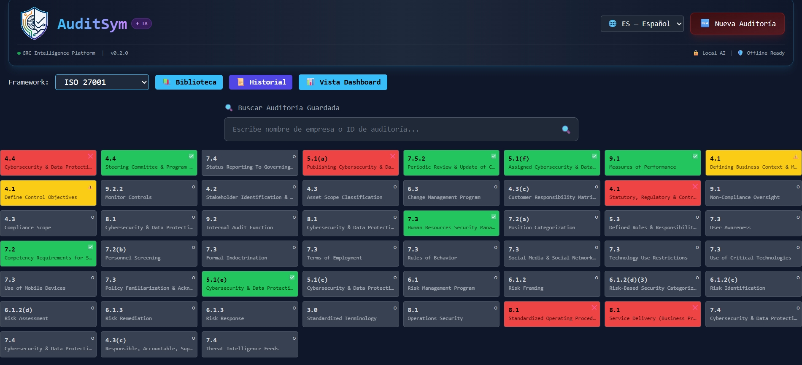
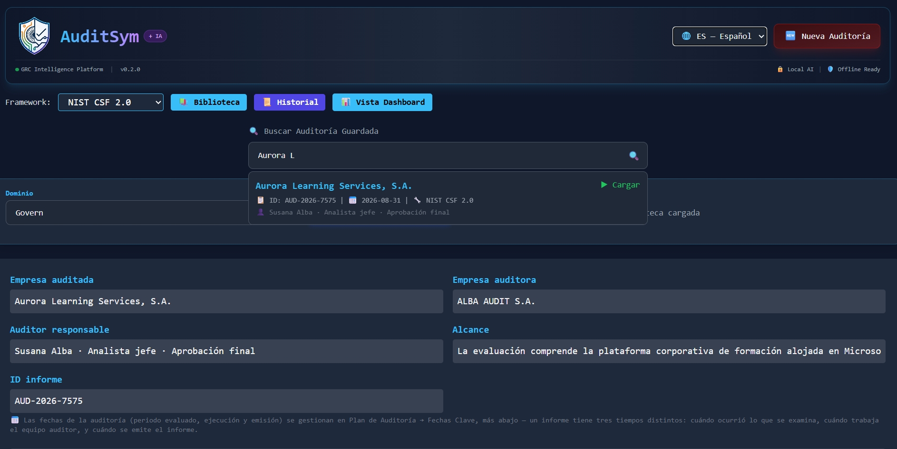
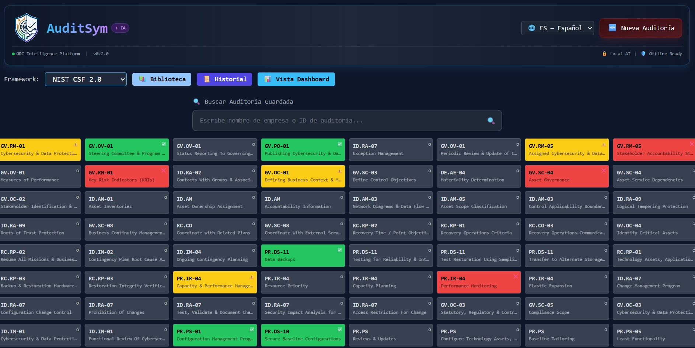
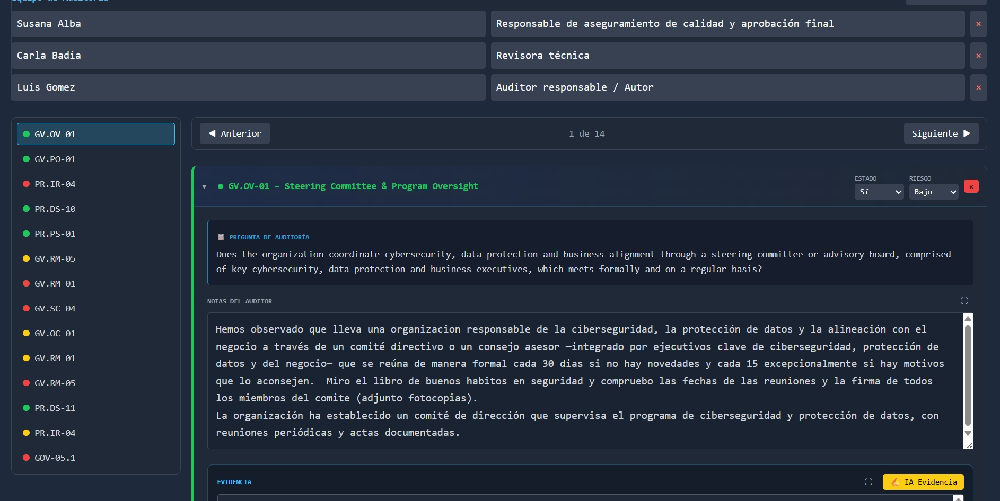
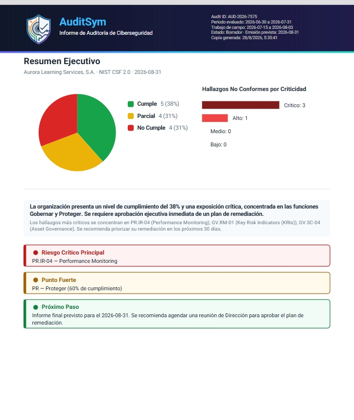
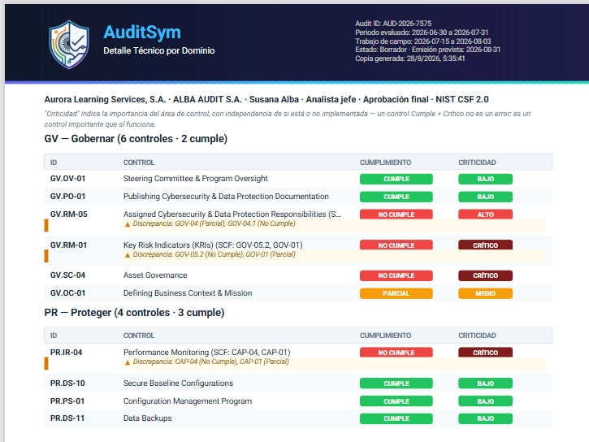
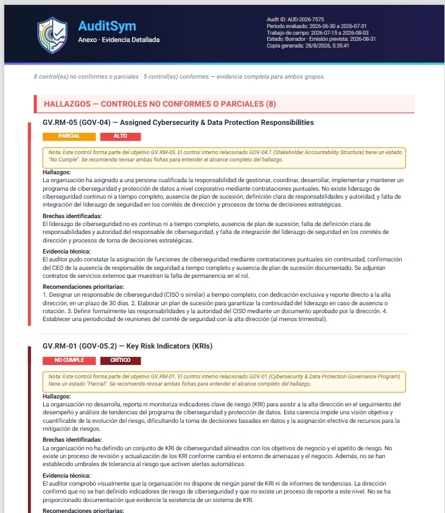

# 🛡️ AuditSym — AI-Assisted Cybersecurity Audit & GRC Platform

<div align="center">

**A local-first, multi-framework GRC intelligence platform with AI-powered auditing, risk remediation, and continuous improvement tracking.**

[](https://github.com/SUALBA/AuditSym/releases)
[](LICENSE)
[](#supported-frameworks)
[](#ai-providers)
[](#privacy--security)

[🚀 Live Demo](https://github.com/SUALBA/AuditSym) · 
[📖 Documentation](docs/) · 
[🐛 Report Bug](https://github.com/SUALBA/AuditSym/issues) · 
[💡 Request Feature](https://github.com/SUALBA/AuditSym/issues)

</div>

---

## 👥 Core Contributors

AuditSym is actively developed and architected by:

#### 👩‍💻 Project Creator · Product Vision 
**Susana Alba Santamaria** 
UX · Audit Methodology · Product Vision 
Cybersecurity & Audit-Focused Builder  
sualba.dev@gmail.com

#### Main Collaborator & Architecture Contributor
**Vandan Panwala**  
Cybersecurity · Software Engineering & Contributor Core Engineering 
🔗 [GitHub Profile](https://github.com/PanwalaVandan)

---

## 🎯 Overview

AuditSym is a comprehensive, **local-first GRC (Governance, Risk & Compliance) intelligence platform** designed for professional auditors, security teams, and compliance officers. It transforms the complexity of cybersecurity frameworks into a practical, visual, and AI-assisted workflow.

Unlike traditional cloud-based GRC tools, AuditSym ensures **absolute data privacy**. All data, AI processing, and evidence remain strictly within your local environment, making it ideal for highly regulated industries, air-gapped networks, and privacy-conscious organizations.

### Why AuditSym?

Cybersecurity frameworks are powerful, but in practice, they are often difficult to operationalize, fragmented, and repetitive to assess. AuditSym solves this by turning complexity into clarity:

| The Problem | The AuditSym Solution |
|-------------|-----------------------|
| Cloud GRC tools expose sensitive data | **100% Local-First** — your data never leaves your browser |
| Expensive SaaS subscriptions | **Open Source & Free** — no license fees, ever |
| Single-framework silos | **Multi-Framework** — NIST, ISO, CIS, COBIT in one place |
| Manual, spreadsheet-based audits | **🧠 AI as a Co-Pilot**, Not an Autopilot. AuditSym uses AI to eliminate the blank-page syndrome. It suggests risk scores, drafts executive narratives, and extracts evidence from your PDFs via local RAG. However, the auditor always retains absolute control. Every AI suggestion requires explicit human validation before being recorded. If AI is unavailable, our deterministic scoring engine steps in seamlessly. Your audit, your criteria, your liability. |
| No prioritization of findings | **Priority Matrix** — Quick Wins first (Impact vs. Effort) |
| No historical tracking | **Evolution Tracking** — year-over-year security improvement |

---

## 📸 Interface Preview

### 📊 Multi-Framework Dashboard


A visual overview of audit activity across frameworks, with summary metrics, compliance visibility, and risk-oriented monitoring.

---

### AI-Assisted Evidence Workflow


Designed to support a more efficient audit process with structured evidence handling and auditor-oriented documentation flow.

---

### Suggested Controls by Domain


Framework-aware control suggestions help speed up audit preparation and make the workflow more practical.

---

### Framework Domain Selection


Controls can be explored from a domain perspective, making the tool easier to use for real audit sessions.

---

### Framework Progress Tracking


Progress bars make it easier to see evaluation coverage across NIST, ISO, CIS, and COBIT at a glance.

---

### Control Grid Overview



A more visual control map helps identify evaluated items and improves audit readability.

---

### Framework Control Workspace


The main workspace is built around practical control handling: compliance, risk, notes, and evidence.

---

### 🗂️ Two Ways to Work: Dashboard View & Work View

AuditSym now offers two interchangeable ways to work on the same audit, toggled with a single button — nothing about the underlying data changes between them, only how it's presented.



**Dashboard View** is built for a visual, at-a-glance overview — KPI cards, framework progress, and a color-coded control grid showing compliance status across everything evaluated so far. It also surfaces quick audit search/load right from the toolbar.



**Work View** is where you land when it's time to actually fill controls in — it still gives you a full grid overview of every control and its current status when you need it, ready to jump into any of them.



From there, selecting a control switches to a compact list on the left and one large, focused panel on the right — question, auditor notes, and evidence all visible at once, with Previous/Next navigation to move through controls without scrolling through a long stacked page. Built for the reality of spending hours entering data, not just reviewing a summary.

---

### 📄 Professional Audit Report (PDF)



The generated PDF opens with a CEO-ready executive summary: compliance and criticality charts, a plain-language posture statement, and the top critical findings named explicitly — no raw control tables on the first page.



Full technical detail is grouped by NIST CSF function/domain, with SCF sub-controls that map to the same framework requirement merged into a single row — and flagged transparently when they disagree with each other, rather than silently picking one.



A detailed evidence annex gives every non-conformant, partial, **and** compliant control its own findings/gaps/evidence/recommendations write-up, alongside a document control cover page, table of contents, and a scope & methodology section — the full structure a client-facing audit report needs, not just a data dump.

---

### Remediation Hub & Priority Matrix


*Automatically classifies findings into Quick Wins, Critical, Opportunities, and Strategic based on Impact vs. Effort.*

### 🤖 AI-Assisted Finding Detail


*Each finding includes AI-assisted remediation guidance and prioritization, evidence suggestions, and complexity/effort analysis.*

---

## ✨ Key Features

### Audit Engine (`auditnist-local.html`)
- **Multi-Framework Support**: Evaluate controls against NIST CSF 2.0, ISO 27001, CIS Controls v8, and COBIT 2019 simultaneously.
- **AI Assessment**: Risk-weighted scoring with maturity model and AI-generated executive narrative.
- **Local RAG**: Semantic search and analysis of PDF policies and procedures (requires local Python server).
- **5 AI Providers**: Ollama (Local), OpenAI, Anthropic, Groq, OpenRouter.
- **Deterministic Fallback**: Works offline with a built-in scoring engine when AI is unavailable.

### 🛠️ Remediation Hub (`remediation-hub.html`)
- **Priority Matrix**: Automatic classification of findings (Quick Wins, Critical, Opportunities, Strategic).
- **Finding Lifecycle**: Open → Assigned → In Progress → Pending Validation → Closed.
- **Risk Acceptance Workflow**: Formal approval with approver, justification, and review date (ISO 27001 / SOX compliant).
- **AI Remediation Copilot (initial version)**: AI-generated recommendations and evidence suggestions per finding.
- **Historical Evolution Dashboard**: Year-over-year security posture tracking and continuous improvement.

### Platform & Privacy
- **7 Languages**: ES, EN, FR, DE, PT, AR, ZH.
- **Local-First Design**: No backend required. All data persists in browser LocalStorage.
- **Offline Ready**: Fully functional without an internet connection.
- **Export/Import**: JSON bidirectional sync between Audit and Remediation modules, plus PDF report generation.

---

## 🏗️ Architecture & Tech Stack

AuditSym is evolving toward a modular, scalable architecture built around:
- **Audit Engine** & **Framework Adapters**
- **Evaluation Registry** & **Template Library**
- **Reporting Engine** & **AI Layer**

**Tech Stack:**
- **Frontend**: HTML5, CSS3 (Tailwind CSS / Custom), JavaScript (ES6+)
- **Visualization**: Chart.js
- **Reporting**: jsPDF, FileSaver.js
- **Storage**: Browser LocalStorage (Local-first)
- **AI Integration**: REST API calls to external providers / Local Ollama
- **RAG**: Optional local Python server (`rag/server.py`) for PDF analysis

---

## 🛣️ Roadmap

### ✅ Phase 1 — Foundation (Completed)
- [x] Multi-framework support (NIST, ISO, CIS, COBIT)
- [x] AI Assessment with 5 providers
- [x] Local RAG for PDF analysis
- [x] Remediation Hub with Priority Matrix
- [x] Risk Acceptance workflow
- [x] 7-language internationalization

### 🔵 Phase 2 — Audit Lifecycle (In Progress)

✔ Initial Remediation Hub
✔ Historical Evolution
✔ Risk Acceptance Workflow

Next:
- [ ] Findings
- [ ] Management Response
- [ ] Closure

### 🟣 Phase 3 — Enterprise & Scale (Future)
- [ ] Collaborative auditing (multi-user sync)
- [ ] Jira / ServiceNow integrations
- [ ] Professional report templates
- [ ] AuditSym Cloud (optional hosted version)

---

## 🤝 How to Contribute

AuditSym welcomes contributors at all levels. Whether you want to improve the interface, refine the logic, or help shape the architecture, there is room to contribute.

### 🟢 Level 1 — Quick Contributions
Good starting tasks for UI/UX improvements:
- [ ] Improve UI spacing and control card layout
- [ ] Improve dashboard styling and chart readability
- [ ] Improve responsiveness and accessibility
- [ ] Improve dark mode consistency

### 🔵 Level 2 — Core Improvements
More technical contributions for the audit logic:
- [ ] Refactor Audit Engine and control data model
- [ ] Improve evaluation persistence and import/export logic
- [ ] Improve state management and performance with large audits

### 🟣 Level 3 — Advanced Ideas
Future-oriented contributions for the platform:
- [ ] Cross-framework mapping engine
- [ ] Advanced risk scoring engine
- [ ] AI audit assistant improvements

---

## 🚀 Running the Project

**Option 1: Direct Open**
Simply open `auditnist-local.html` or `remediation-hub.html` in your browser.

**Option 2: Local Server (Recommended)**

```bash
python -m http.server 8080
```

Then visit: http://localhost:8080

**Option 3: Local RAG Server (Optional)**

For PDF semantic search and document analysis, start the RAG server:

```bash
python rag/server.py
```

Then use the "Auto Analyze" feature in the Audit Engine.

---

## 🧪 Regression Testing

> **This section is for whoever is touching the code , not for regular users.** If you just want to use AuditSym, the
> "Running the Project" steps above are all you need — nothing below this
> point is required to open or use the app.

A Playwright-based regression suite covers the real bugs found and fixed
during development — stale cross-session data leaking into a fresh audit,
a broken JSON import, silent data loss on save/reload, incorrect NIST CSF
code resolution, and a handful of others — so a future change can't
silently reintroduce any of them. Run it before pushing a change that
touches `auditnist-local.html`.

**Prerequisites:** [Node.js](https://nodejs.org) 18 or later.

**Setup (one time):**

```bash
npm install --save-dev playwright
npx playwright install chromium
```

**Run it:**

```bash
node tests/e2e/regression_suite.mjs
```

This runs headless — no browser window will open, that's expected. The
suite reads the app's own `data/scf-controls.json` directly (never a
separate copy), spins up its own local server for the duration of the run,
and prints a PASS/FAIL line per check, e.g.:

```
▶ 1. Fresh session must not leak data from previous audits
  ✅ Dashboard total starts at 0 on a fresh session
  ✅ Control library grid is not pre-colored from a past session
...
RESULT: 23 passed, 0 failed
```

**If you see a ❌:** don't push yet. Re-run the suite once to rule out a
flaky run, then check whether your change genuinely affects that behavior.
If it's a real regression, fix it before pushing; if the test itself seems
wrong for a legitimate new behavior, update the test rather than deleting
or skipping it, and mention the change in your commit message.

If your repo layout differs from the default `tests/` + `ui/` + `data/`
sibling structure (which already matches this repo), override either path:

```bash
AUDITSYM_HTML=path/to/auditnist-local.html \
AUDITSYM_SCF_DATA=path/to/scf-controls.json \
node tests/e2e/regression_suite.mjs
```

---

## 📄 License

This project is licensed under the GNU Affero General Public License v3.0 (AGPL-3.0).
See the LICENSE file for details.

**What this means:**
- ✅ Free to use, modify, and distribute.
- ✅ Can be used commercially.
- ⚠️ Modifications must also be open source (AGPL).
- ⚠️ Network use requires sharing source code.

This license protects the open-source nature of AuditSym while allowing commercial consulting and support services.

---
## Sample Audit Report

Explore a demonstration NIST CSF 2.0 audit report generated by AuditSym:

[View the AuditSym NIST CSF 2.0 sample report](docs/samples/auditsym-nist-csf-2.0-sample-report.pdf)

> This demonstration uses entirely synthetic data and does not represent a
> real organization, certification, or assurance opinion.

---

## ⭐ Support the Project

If you find AuditSym useful:
- Give the repository a star ⭐
- Open issues for improvements or bugs
- Contribute new framework adapters or translations
- Share your feedback and use cases

AuditSym is being built to make cybersecurity audits more structured, intelligent, and privacy-first.

---

<div align="center">


**AuditSym**

*AI-Assisted Cybersecurity Audit & GRC Platform*

**Plan • Assess • Report • Remediate • Improve**

⬆ [Back to top](#-auditsym--ai-assisted-cybersecurity-audit--grc-platform)

</div>